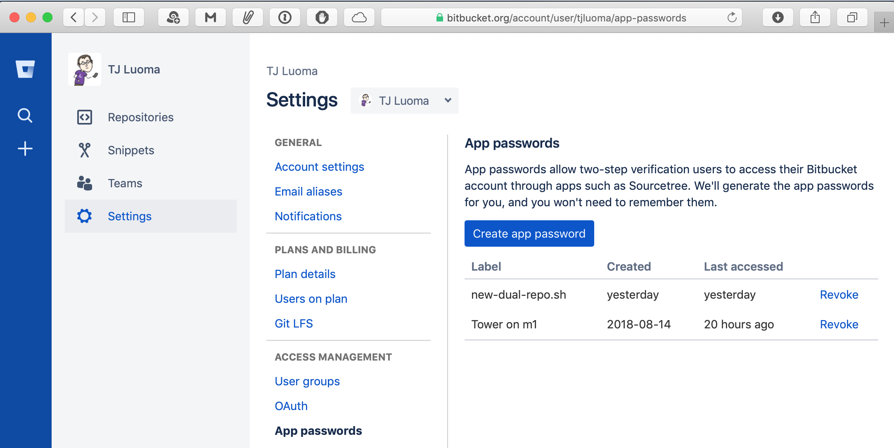

# new-dual-repo

TL;DR: This script will help you make a new git repository on both [GitHub.com](https://github.com) and [Bitbucket.org](https://Bitbucket.org) and set up the repo so that all changes will be pushed to both places.

## How to Configure `new-dual-repo.sh`

There are a few things that you need to configure in the `new-dual-repo.sh` script.

There are only 5 simple changes, and they are each fairly straightforward.

### GIT_APP

Ok, maybe you’re a command-line purist, but for the rest of us, there are several good choices out there:

* [Sourcetree](https://www.sourcetreeapp.com)

* [Tower](https://www.git-tower.com/mac)

* [GitHub Desktop](https://desktop.github.com)

* [GitKraken](https://www.gitkraken.com)

* [SmartGit](https://www.syntevo.com/smartgit/)

Set `GIT_APP=` to be the name of the app, like so:

	GIT_APP='Sourcetree'

Note the lack of “.app” extension, and if you use “GitHub Desktop” don’t forget the space in the name.

**Note For Major Mac Geeks Only:**

This script assumes that your `GIT_APP` is installed in either /Applications/ or `$HOME/Applications/`.

If it is somewhere else, you’ll need to make some minor changes to the script. Look for this line:

	if [ -e "/Applications/${GIT_APP}.app" -o -e "$HOME/Applications/${GIT_APP}.app" ]

and edit the folder name to reflect the actual location of your app.

### GITHUB_USERNAME

Set this to your username on GitHub. For example, mine is [tjluoma](https://github.com/tjluoma), so I would use:

	GITHUB_USERNAME='tjluoma'

look for this line:

	GITHUB_USERNAME='CHANGE_TO_YOUR_GITHUB_USERNAME'

and edit accordingly.

### BITBUCKET_USERNAME

Just like `GITHUB_USERNAME`, but set it to your Bitbucket username. Again, mine is [tjluoma](https://bitbucket.org/tjluoma/), so I’d use:

	BITBUCKET_USERNAME='tjluoma'

Look for the line:

	BITBUCKET_USERNAME='CHANGE_TO_YOUR_BITBUCKET_USERNAME'

and edit accordingly.

### GITHUB_PERSONAL_ACCESS_TOKEN

I’m going to assume that you are using Two-Factor Authentication, or 2FA, with GitHub. Because, seriously, why wouldn’t you?

If so, you will need to generate a “Personal access token” which you can do at [https://github.com/settings/tokens](https://github.com/settings/tokens).

It will look something like this:

Click the “Generate new token” button (near the top-right) and take note of the password. Keep it secure, and don’t share it with anyone.

Then look for this line in the script:

	GITHUB_PERSONAL_ACCESS_TOKEN="REPLACE_THIS_WITH_THE_REAL_VALUE"

and edit accordingly.

_If you _aren’t_ using 2FA, I’m sure you can probably adapt this script to your needs, but I would sincerely recommend [learning about two-factor authentication on GitHub](https://help.github.com/articles/about-two-factor-authentication/). It’s easy to setup and really doesn’t make things much more difficult, and it’s a lot safer._

### BITBUCKET_APP_PASSWORD

Similarly, if you aren’t using 2FA for Bitbucket, you’ll need to edit this script -- or, preferably, IMO, -- [learn how to enable 2FA on your Bitbucket account](https://confluence.atlassian.com/bitbucket/two-step-verification-777023203.html).

Once you have it enabled, go to **https://bitbucket.org/account/user/BITBUCKET_USERNAME/app-passwords** (where “BITBUCKET_USERNAME” is your actual Bitbucket username). It should look something like this:

Click “Create App Password” and then add it to the script where you see this:

	BITBUCKET_APP_PASSWORD='REPLACE_THIS_WITH_THE_REAL_VALUE'

### That’s it!

## “How do I use the script?”

`new-dual-repo.sh` is designed to be fairly easy to use. Save the script somewhere in your `$PATH` such as `/usr/local/bin/new-dual-repo.sh`
and make sure it’s executable:

	chmod 755 /usr/local/bin/new-dual-repo.sh

Once you have it installed (and configured, as explained above), just `cd` into whatever directory you want to use as a new “dual repo”:

	mkdir ~/git/my-new-repo

	cd ~/git/my-new-repo

Once you are there, you have two choices.

First, you could just run `new-dual-repo.sh` like this:

	new-dual-repo.sh

If you do this, the script will:

* use the default settings for `PRIVATE` (which is `false`, meaning that the repos will be public by default).

* prompt you to create a brief description of the repo

* prompt you to name the repo

This “name” is the “slug” that you are probably familiar with. For example, this repo name is “new-dual-repo”.

*However,* if you would rather not do all that interactively, your _second_ option is to use the following arguments to `new-dual-repo.sh`.

Example:

	new-dual-repo.sh --name "my-new-repo" -d "This is a new project I'm working on."

There are only a few arguments possible:

**Most importantly,** you can specify the _name_ of the repo like so:

	--name "my-new-repo"

_Note that “my-new-repo” must **not** be in use already on either your GitHub account or your Bitbucket account, or else this script will fail._

**Second-most-importantly,** if you want to specify the description without being prompted, you can use with `-d` or `--description`, like this:

	-d "This is my short description"

or

	--description "This is my short description"

Note that your description _must_ be enclosed in quotes.

_Both a name and a description are considered to be required by the script, and it will not continue until you set both._

**Finally, and completely optionally,** you can also explicitly set the repo to public or private by using either

	--public

or

	--private

_A reminder: you must have a paid GitHub account to create a private GitHub repo._ Hence, the script defaults to creating public repos. If you want to change the default to private, edit the line:

	PRIVATE='false'

in the script to be:

	PRIVATE='true'

But remember you can always override the default by using either `--public` or `--private`

## Questions?

Ask away. You can find me [@tjluoma](http://twitter.com/tjluoma) on Twitter, or create an issue on [Bitbucket](https://bitbucket.org/tjluoma/new-dual-repo/issues/new) or [GitHub](https://github.com/tjluoma/new-dual-repo/issues/new).

## License

No warranty provided, either expressly or implicitly. Use entirely at your own risk, etc.

Feel free to take it and adapt as you’d like. A link back to the original is always nice, but that’s all I ask.

